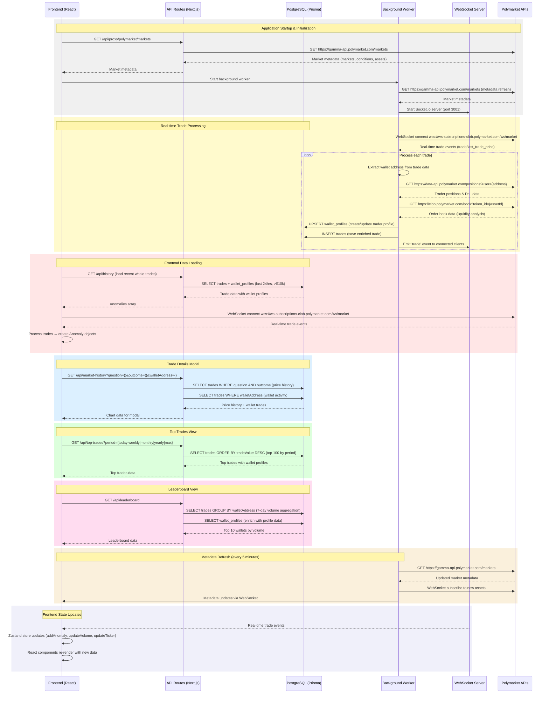

```mermaid
graph TB
    %% External Services
    subgraph "External APIs"
        PM[Polymarket APIs]
        PM_WS[Polymarket WebSocket<br/>wss://ws-subscriptions-clob...]
        PM_Gamma[Gamma API<br/>gamma-api.polymarket.com]
        PM_Data[Data API<br/>data-api.polymarket.com]
        PM_CLOB[CLOB API<br/>clob.polymarket.com]
    end

    %% Application Components
    subgraph "Frontend (Next.js)"
        FE[React Components]
        Store[Zustand Store<br/>useMarketStore]
        WS_Client[WebSocket Client]
    end

    subgraph "Backend (Next.js API Routes)"
        HistoryAPI[/api/history]
        TopTradesAPI[/api/top-trades]
        LeaderboardAPI[/api/leaderboard]
        MarketHistoryAPI[/api/market-history]
        ProxyMarketsAPI[/api/proxy/polymarket/markets]
        ProxyEventsAPI[/api/proxy/polymarket]
    end

    subgraph "Background Worker (Node.js)"
        Worker[Trade Processor<br/>server/worker.ts]
        WS_Server[Socket.io Server<br/>Port 3001]
        Intelligence[Intelligence Module<br/>lib/intelligence.ts]
    end

    subgraph "Database (PostgreSQL)"
        Trades[trades table]
        WalletProfiles[wallet_profiles table]
    end

    %% Data Flow Connections
    FE --> Store
    Store --> WS_Client
    Store --> HistoryAPI
    Store --> TopTradesAPI
    Store --> LeaderboardAPI

    FE --> MarketHistoryAPI
    FE --> ProxyMarketsAPI

    HistoryAPI --> Trades
    HistoryAPI --> WalletProfiles

    TopTradesAPI --> Trades
    TopTradesAPI --> WalletProfiles

    LeaderboardAPI --> Trades
    LeaderboardAPI --> WalletProfiles

    MarketHistoryAPI --> Trades
    MarketHistoryAPI --> WalletProfiles

    ProxyMarketsAPI --> PM_Gamma
    ProxyEventsAPI --> PM_Gamma

    Worker --> PM_WS
    Worker --> WS_Server
    Worker --> Intelligence

    Intelligence --> PM_Data
    Intelligence --> PM_CLOB

    Worker --> Trades
    Worker --> WalletProfiles

    WS_Server --> WS_Client

    %% Styling
    classDef apiRoutes fill:#e1f5fe,stroke:#01579b,stroke-width:2px
    classDef external fill:#f3e5f5,stroke:#4a148c,stroke-width:2px
    classDef database fill:#e8f5e8,stroke:#1b5e20,stroke-width:2px
    classDef worker fill:#fff3e0,stroke:#e65100,stroke-width:2px
    classDef frontend fill:#fce4ec,stroke:#880e4f,stroke-width:2px

    class HistoryAPI,TopTradesAPI,LeaderboardAPI,MarketHistoryAPI,ProxyMarketsAPI,ProxyEventsAPI apiRoutes
    class PM,PM_WS,PM_Gamma,PM_Data,PM_CLOB external
    class Trades,WalletProfiles database
    class Worker,WS_Server,Intelligence worker
    class FE,Store,WS_Client frontend
```

## API Calls and Database Operations Summary

### API Endpoints
1. **GET /api/history** - Recent whale trades (24hrs, >$10k)
2. **GET /api/top-trades?period={period}** - Largest trades by time period
3. **GET /api/leaderboard** - Top 10 wallets by 7-day volume
4. **GET /api/market-history?question={}&outcome={}&walletAddress={opt}** - Price history + wallet activity
5. **GET /api/proxy/polymarket/markets** - Market metadata from Polymarket
6. **GET /api/proxy/polymarket** - Events data from Polymarket

### Database Operations
- **INSERT trades** - New trade records from WebSocket
- **UPSERT wallet_profiles** - Create/update trader intelligence
- **SELECT trades** with **JOIN wallet_profiles** - Various queries for frontend

### External API Calls
- **WebSocket**: `wss://ws-subscriptions-clob.polymarket.com/ws/market`
- **Gamma API**: `https://gamma-api.polymarket.com/markets`
- **Data API**: `https://data-api.polymarket.com/positions? mddress}`
- **CLOB API**: `https://clob.polymarket.com/book?token_id={assetId}`

### Real-time Data Flow
1. Polymarket WebSocket → Background Worker → Intelligence enrichment → Database → Socket.io → Frontend
2. Frontend WebSocket → Direct processing → Zustand store → React components

### Key Data Transformations
- Raw trades → Enriched anomalies (market metadata + trader profiles)
- Database records → Frontend-compatible anomaly objects
- WebSocket events → UI state updates
